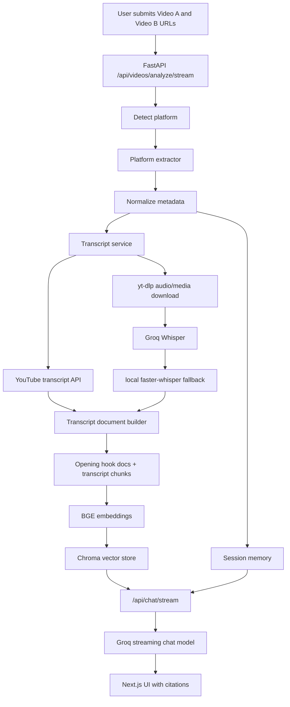

# Social Video RAG Chatbot

A full-stack RAG application for comparing two social videos. The app accepts two
YouTube, TikTok, or Instagram URLs, extracts metadata and transcripts, stores
timestamped transcript chunks in Chroma, and lets the user ask streamed follow-up
questions with source citations.

The project is a demo, but the code is organized
like a small production service: platform extraction is isolated, transcript and
retrieval work live behind service boundaries, and the frontend is split into
focused components and hooks.

## Core Features

- Compare two social video URLs in one analysis session.
- Detect supported platforms: YouTube, TikTok, and Instagram.
- Extract normalized video metadata:
  - title
  - creator and creator id
  - follower count when available
  - views, likes, comments
  - engagement rate
  - upload date, duration, hashtags, and source URL
- Retrieve YouTube transcripts directly when available.
- Fall back to audio download plus Whisper transcription for TikTok, Instagram,
  and YouTube videos without native transcripts.
- Try Groq Whisper first, then local `faster-whisper` in `auto` mode.
- Preserve transcript timestamps in chunks.
- Add dedicated `Opening hook (0-5 seconds)` documents for hook questions.
- Store chunks in a session-filtered Chroma vector collection.
- Stream ingestion progress and chat responses with Server-Sent Events.
- Return source chunks after every assistant answer.
- Keep recent chat history in memory for conversational follow-up.
- Provide a polished Next.js workspace UI with componentized video cards, chat,
  markdown rendering, progress logs, and custom favicon/app branding.

## Tech Stack

**Frontend**

- Next.js 16
- React 19
- TypeScript
- Tailwind CSS
- Server-Sent Events
- `react-markdown` and `remark-gfm`
- `lucide-react`

**Backend**

- FastAPI
- Pydantic settings and schemas
- LangChain message/document abstractions
- Groq chat model
- Groq Whisper transcription
- local `faster-whisper` fallback
- Hugging Face BGE embeddings
- Chroma vector store
- `yt-dlp`
- `youtube-transcript-api`
- `curl-cffi` for yt-dlp browser impersonation support

## How It Works



The ingestion route streams progress while it works, so the frontend can show
metadata extraction, transcript fetching, chunking, vector indexing, and final
completion instead of freezing during slower platform calls.

## Repository Layout

```text
rag-video-chatbot/
  backend/
    app/
      api/
        chat_routes.py
        dependencies.py
        routes.py
        video_routes.py
      core/
        config.py
      schemas/
        chat.py
        video.py
      services/
        extractors/
          base.py
          instagram_extractor.py
          tiktok_extractor.py
          video_extractor.py
          youtube_extractor.py
        ingestion/
          progress.py
          service.py
        media/
          audio_downloader.py
          ytdlp_options.py
        rag/
          formatters.py
          llm.py
          memory_store.py
          service.py
        retrieval/
          chroma_telemetry.py
          embeddings.py
          vector_store.py
        transcripts/
          document_builder.py
          service.py
      utils/
        sse.py
        streaming.py
        url_utils.py
    tests/
    .env.example
    requirements.txt

  frontend/
    public/
      app-icon.svg
    src/
      app/
        favicon.ico
        globals.css
        layout.tsx
        page.tsx
      components/
        chat/
        layout/
        video/
      hooks/
      lib/
      types/
    package.json
```

## API Endpoints

| Method | Endpoint | Purpose |
| --- | --- | --- |
| `GET` | `/` | Backend root message and docs link |
| `GET` | `/api/health` | Lightweight readiness check |
| `POST` | `/api/videos/analyze` | Run ingestion and return final JSON |
| `POST` | `/api/videos/analyze/stream` | Stream ingestion progress and final result |
| `POST` | `/api/chat/stream` | Stream RAG answer tokens, sources, and completion |

### Analyze Request

```json
{
  "video_a_url": "https://www.youtube.com/shorts/exampleA",
  "video_b_url": "https://www.youtube.com/shorts/exampleB",
  "session_id": null
}
```

If `session_id` is omitted or blank, the backend creates a new one.

### SSE Events

`/api/videos/analyze/stream` emits:

- `progress`
- `result`
- `error`
- `done`

`/api/chat/stream` emits:

- `token`
- `sources`
- `error`
- `done`

## Environment Variables

Create the backend environment file from `backend/.env.example`:

```powershell
cd backend
copy .env.example .env
```

Required:

```text
GROQ_API_KEY=your_groq_api_key
```

Important backend settings:

```text
FRONTEND_ORIGIN=http://localhost:3000
GROQ_MODEL=llama-3.1-8b-instant
GROQ_TRANSCRIPTION_MODEL=whisper-large-v3-turbo
TRANSCRIPTION_PROVIDER=auto
LOCAL_WHISPER_MODEL=base
LOCAL_WHISPER_DEVICE=cpu
LOCAL_WHISPER_COMPUTE_TYPE=int8
EMBEDDING_MODEL=BAAI/bge-small-en-v1.5
CHROMA_DIR=storage/chroma
CHROMA_COLLECTION=social_video_chunks
DOWNLOAD_DIR=storage/downloads
CHUNK_SIZE=900
CHUNK_OVERLAP=150
RETRIEVAL_K=6
```

The code default for `GROQ_MODEL` is `llama-3.3-70b-versatile` for stronger
answers, while `.env.example` keeps `llama-3.1-8b-instant` as the cheaper,
faster starter option. Use whichever is available on your Groq plan.

Useful `yt-dlp` settings:

```text
YTDLP_COOKIES_FROM_BROWSER=firefox
YTDLP_JS_RUNTIME=auto
YTDLP_NO_CHECK_CERTIFICATE=true
YTDLP_SOCKET_TIMEOUT=60
```

Frontend environment:

Create the frontend environment file from `frontend/.env.example`:

```powershell
cd frontend
copy .env.example .env
```

```text
NEXT_PUBLIC_API_BASE_URL=http://localhost:8000
```

## Local Setup

### Backend

```powershell
cd backend
python -m venv venv
venv\Scripts\activate
pip install -r requirements.txt
copy .env.example .env
```

Edit `backend/.env`, add `GROQ_API_KEY`, then run:

```powershell
uvicorn app.main:app --reload
```

Backend runs at:

```text
http://localhost:8000
```

Swagger docs are available at:

```text
http://localhost:8000/docs
```

### Frontend

```powershell
cd frontend
npm install
```

Create `frontend/.env.local`:

```text
NEXT_PUBLIC_API_BASE_URL=http://localhost:8000
```

Run:

```powershell
npm run dev
```

Frontend runs at:

```text
http://localhost:3000
```

## Platform Notes

### YouTube

YouTube is the most reliable demo path. The app first tries
`youtube-transcript-api`, which is fast and free. If no transcript is available,
it downloads audio with `yt-dlp` and transcribes it.

### TikTok

TikTok uses `yt-dlp` plus Whisper transcription. If TikTok is blocked on the
local network, use an OS-level VPN before starting the backend. The backend
keeps metadata and media downloads on the same machine network path instead of
mixing proxy routes, which avoids many truncated-media failures.

### Instagram

Instagram is the least deterministic source. The extractor uses direct `yt-dlp`
metadata first, then falls back through profile/media/clips data and page
parsing where available. Browser cookies can improve reliability, but public
Reels may still hide views, followers, or engagement fields depending on login
state, region, rate limits, and Instagram response changes.

## RAG Design Choices

**Session-filtered retrieval**

Every chunk is stored with `session_id`, and retrieval filters by that value.
This prevents one analysis session from leaking into another answer.

**Opening-hook documents**

The document builder creates a special 0-5 second document whenever transcript
timestamps are available. Hook-related questions pull those documents into the
context before normal semantic retrieval, so answers do not claim the first five
seconds are missing when timestamped evidence exists.

**Retrieval count clamping**

The vector store counts available documents for the session and clamps `k`
before calling Chroma. This avoids noisy warnings when a short video has fewer
chunks than `RETRIEVAL_K`.

**Local embeddings**

`BAAI/bge-small-en-v1.5` keeps embedding cost at zero and works well for short
transcripts. A managed embedding provider could improve quality, but it would
add another paid dependency.

**Straightforward RAG instead of agents**

The workflow is deterministic: extract, transcribe, chunk, retrieve, answer.
LangChain is used for documents, messages, Chroma, text splitting, embeddings,
and Groq integration without adding an agent layer that would make behavior
harder to debug.

## Frontend Design

The frontend is a focused workspace, not a landing page. The first screen is the
actual analysis tool:

- `AppShell` owns the stable full-height layout and custom app mark.
- `VideoUrlForm` and `VideoUrlInput` handle URL submission.
- `VideoComparisonPanel` coordinates cards, progress logs, and summary state.
- `VideoCard` is split into preview, stats, creator, hashtags, and metadata
  subcomponents.
- `ChatPanel` is split into header, message list, empty state, composer,
  markdown rendering, source list, suggested questions, and typing indicator.
- `useVideoAnalysis` manages streaming ingestion state.
- `useStreamingChat` manages streamed assistant responses and source events.

The UI intentionally avoids repeating followers and duration below the video
cards because those values already appear in the stats grid.

## Testing And Verification

Backend:

```powershell
cd backend
venv\Scripts\python.exe -m compileall app
venv\Scripts\python.exe -m unittest discover -s tests
```

Frontend:

```powershell
cd frontend
npm run lint
npm run build
```

Notes from the latest verification work:

- Backend compile and unit tests passed after the service refactor.
- Frontend lint passed after the component/comment/branding updates.
- In this sandbox, `npm run build` can compile successfully and then fail with
  `spawn EPERM` when Next.js starts worker processes. Run the same command in a
  normal terminal to complete production-build verification.

## Assessment Talking Points

### What Is Dynamic

- URL input
- platform detection
- metadata extraction
- transcript extraction
- engagement-rate calculation
- timestamp-aware chunk creation
- opening-hook retrieval
- vector search
- RAG answer generation
- source citations
- chat memory
- streamed progress and chat events

### What Is Static

- suggested questions in the UI
- default model names and local configuration values
- local storage locations

The suggested questions are only UI affordances. The answers come from the
current analysis session and retrieved evidence.

### Why This Handles 1000 Creators Per Day

The demo runs ingestion synchronously for simplicity, but the service boundaries
already map to a scalable version:

```text
FastAPI request -> job queue -> ingestion workers -> metadata DB/vector DB -> frontend progress
```

At 1000 creators per day and two videos per creator, the average load is about
2000 videos per day, or roughly 1.4 videos per minute. The hard part is burst
handling and unreliable platform extraction, not average throughput.

For production, the next version should add:

- queue-based ingestion workers
- retry and backoff per extraction/transcription stage
- metadata and transcript cache by platform id
- Redis or Postgres-backed job/session state
- shared vector infrastructure such as Qdrant, pgvector, Pinecone, or Weaviate
- observability, request ids, and failure dashboards

### Cost Strategy

The app keeps the default cost profile low by:

- using native YouTube transcripts before transcription
- using local embeddings
- storing vectors locally in Chroma
- using a fast Groq chat model by default in `.env.example`
- transcribing only when transcripts are unavailable

The most expensive path is long audio transcription. A production version should
transcode long audio to 16 kHz mono, split it into size-capped chunks, transcribe
within provider limits, and merge timestamped segments.

## Known Limitations

- Chat/session memory is process-local and disappears on restart.
- Local Chroma is not shared across backend instances.
- Ingestion is synchronous in the demo.
- Instagram and TikTok can fail because of cookies, bot checks, regional
  restrictions, hidden fields, or rate limits.
- Long videos can exceed transcription upload limits because audio splitting is
  not implemented yet.
- There is no authentication, quota system, CI pipeline, or deployment package.

## Production Roadmap

If this were moving beyond assessment/demo stage, the next work would be:

- Add a queue such as Celery, RQ, or BullMQ.
- Store sessions, videos, and job state in Postgres.
- Store short-lived progress/chat state in Redis.
- Replace local Chroma with Qdrant, pgvector, or a managed vector DB.
- Add audio splitting and parallel transcription for long videos.
- Add cache keys based on `platform + platform_id`.
- Add structured logs, traces, and request ids.
- Add integration tests for real YouTube, TikTok, and Instagram URLs.
- Add Docker/Compose and CI.
- Add API auth and per-user quotas.

## Demo Script

1. Start the backend.
2. Start the frontend.
3. Open `http://localhost:3000`.
4. Paste two YouTube Shorts for the most reliable demo path.
5. Click Analyze and show live progress events.
6. Show video cards, metrics, engagement rate, and transcript chunk count.
7. Ask:
   - `What is the engagement rate of each video?`
   - `Which video performed better and why?`
   - `Compare the hooks in the first 5 seconds.`
   - `Suggest improvements for the weaker video.`
8. Point out that each answer streams and then returns source chunks.

## Current Status

Working:

- YouTube Shorts/Reels-style URL analysis
- TikTok metadata and transcription path through `yt-dlp`
- Instagram extraction with multiple fallbacks
- Groq and local Whisper transcript fallback
- timestamped transcript chunks
- opening-hook retrieval
- Chroma vector storage
- session-filtered RAG chat
- streamed analysis and chat
- source citations
- componentized frontend workspace

Needs production hardening:

- background jobs
- durable session storage
- long-audio splitting
- shared vector DB
- auth/quotas
- deployment packaging
- broader live-platform integration tests
